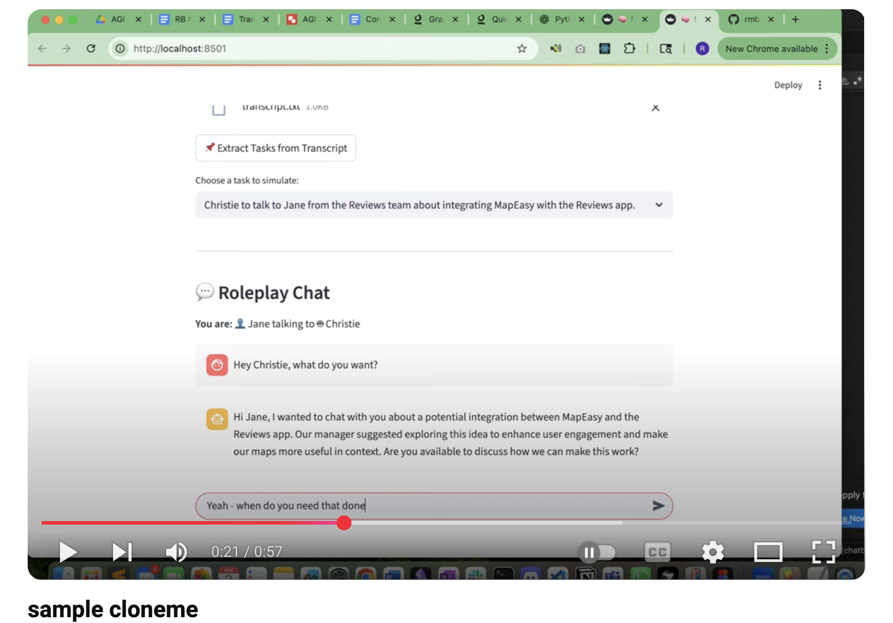
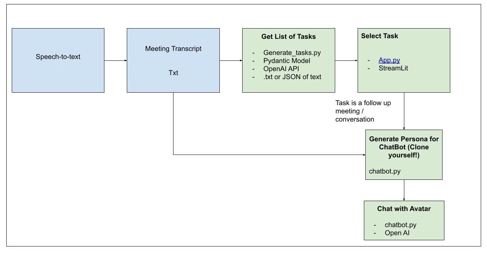
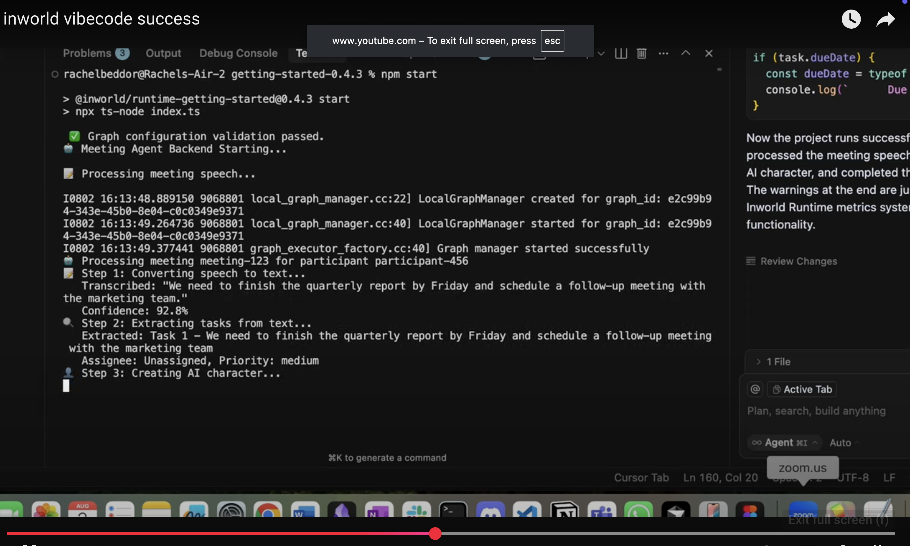
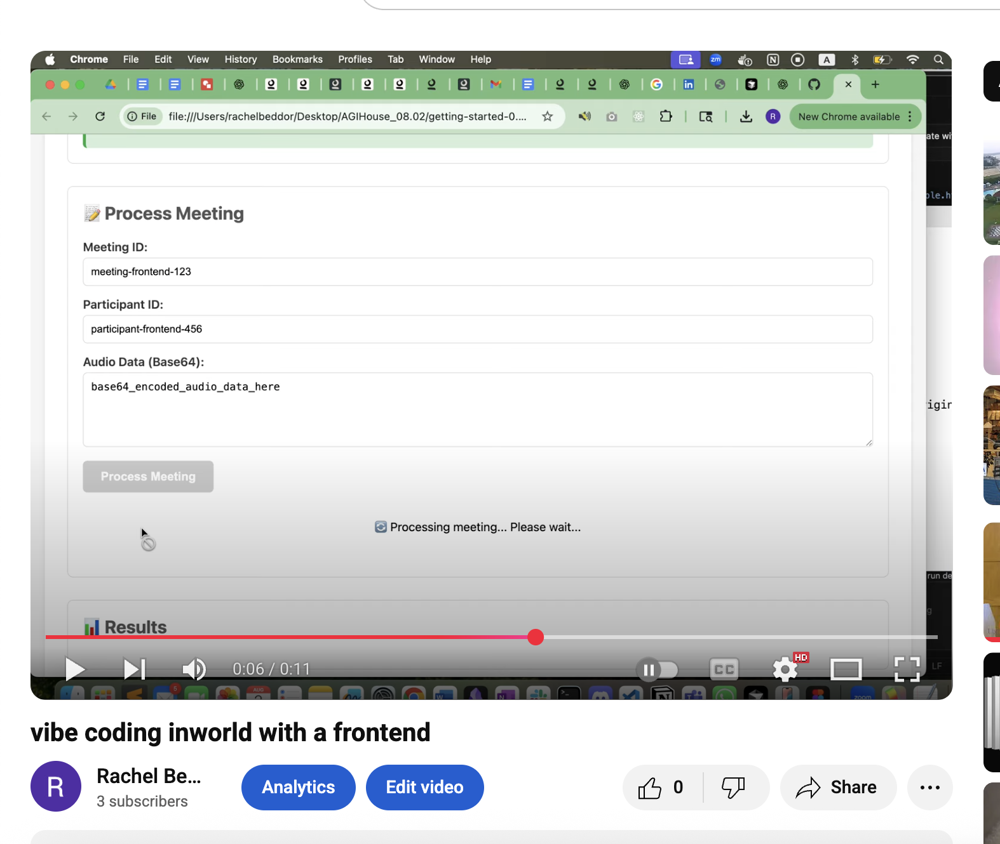

# 🧠 AGI House Hackathon – 08.02.2025

## 🚀 Pitch: No More To-Do Lists!

**Ditch Your To-Do List!!!** 

Imagine if your "action items" from a meeting automatically happened for you!

Thanks to **AI**, we can generate and **complete your follow-ups**—in real time or using transcripts after the fact.

And yes, some follow-ups require **more meetings** (ugh, *meeting inception* 😩). But what if...

🤖 **You could clone yourself** using your meeting transcript  
💬 And your clone could handle the **follow-up meeting** for you  
🎉 **No more meetings!!!!**


*cloning myself because the world needs more of me!*


## 🛠️ Demo: AI-Powered Meeting Clone

This is a **bare-bones prototype**, but it works!

- 📄 Upload a **meeting transcript**
- ⚡ API generates **tasks from the meeting**
- 👥 If a task is a **follow-up meeting**, we use the transcript + task to **create a chatbot version of you**
- 🧑‍💼 Your clone handles the next meeting (think: simulated Slack convo)

Future vision: seamless integration into your favorite **meeting platforms**.

[](https://www.youtube.com/watch?v=9crb3mSyFv8)


## Architecture

[](https://docs.google.com/drawings/d/1Ky5M7jLHlnTaymkUq50rNUKajuXyqPTLvEGs45hiuuo/edits)


## Transcript -> Tasks (generate_tasks_api)

- This is used for the stage where you take the transcript and put it into tasks

How to Run the API (open on amazon temporarily)

if your transcript is in a JSON

```
curl -X POST http://54.91.226.222:8000/extract-tasks \
  -H "Content-Type: application/json" \
  -d '{"transcript": "We agreed that Sarah will send the proposal by Friday and Tom will handle the budget review."}'
```

or if you have it in a txt file e.g. `transcript.txt`

```
jq -Rs '{transcript: .}' transcript.txt | curl -X POST http://54.91.226.222:8000/extract-tasks \
  -H "Content-Type: application/json" \
  -d @-
``` 

### How to run this one in the backend
- inside the AWS VM run 

```
nohup uvicorn generate_tasks:app --host 0.0.0.0 --port 8000 > uvicorn.log 2>&1 &
disown
```
but that keeps it in the foreground so put it in the background with
`ps aux | grep uvicorn` check to see the PID
`kill <PID>`


## Chatbot

`streamlit run app.py`


 ## Vibe Coded InWorld

 - Thanks to Audi from InWorld for giving me a whole demo on how to use their product via vibe coding with Cursor! So fun, I've included some cool videos here. 

- InWorld could be used in the future to scale this project and bring it to life! I love the concept behind InWorld and can't wait to follow all of their success in the future! 


### vibe coding with InWorld
[](
https://youtu.be/ln39A0MHB5I)


### after I had it add a frontend 
[](
https://www.youtube.com/watch?v=Bg6pdtxNZ98)


 - runtime quickstart https://docs.inworld.ai/docs/node/quickstart

